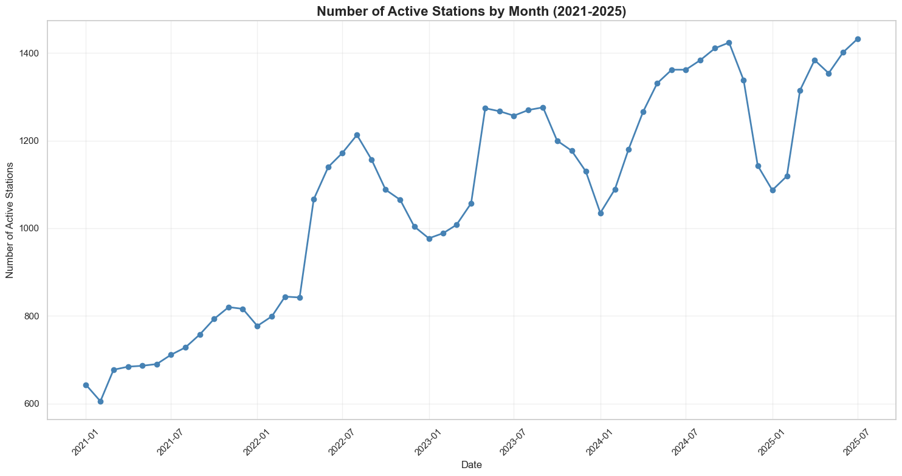

# Demand Prediction for Bike Share System Expansion

This project aims to predict the trip demand at new stations when bike share systems consider expanding. To plan successful bike share systems , many cities start from a small-scale pilot and gradually expand the system to cover more areas. Planning new stations based on existing ones over time requires prediction of the number of trips generated by these new stations across the whole system. This project will leverage historical trip data from existing stations and predict ridership at candidate sites.


### Divvy system has been expanding over the past few years


## Project Overview

This project develops predictive models for bike share station demand by integrating multiple data sources. The models can predict demand at any location in Chicago, enabling data-driven decisions for system expansion.

### Key Capabilities
- **Location-Based Predictions**: Predict demand at any coordinate in Chicago
- **12-Month Forecasts**: Monthly predictions for classic and electric bikes
- **City-Wide Coverage**: Pre-computed predictions for 810 H3 cells across Chicago
- **Interactive Exploration**: Web app for visualizing predictions on a map

### Data Sources
The models integrate multiple data sources including:
- **Divvy bike share trip data** (2021-2025)
- **Census demographic data** (Cook County)
- **Points of Interest (POI) data** from OpenStreetMap
- **Transportation infrastructure** (CTA stations, bus stops, bike routes)
- **Spatial proximity metrics** (station density at various distances)

The models predict four key metrics:
- `cbike_start`: Average daily classic bike trip starts by month
- `cbike_end`: Average daily classic bike trip ends by month  
- `ebike_start`: Average daily electric bike trip starts by month
- `ebike_end`: Average daily electric bike trip ends per month

## Key Results

### Model Performance Summary

| Model Type | Target Variable | Test R² | Test RMSE | Test MAE |
|------------|----------------|---------|-----------|----------|
| **XGBoost** | cbike_start | **0.796** | 4.93 | 2.25 |
| **XGBoost** | cbike_end | **0.795** | 4.95 | 2.27 |
| **XGBoost** | ebike_start | **0.897** | 2.87 | 1.36 |
| **XGBoost** | ebike_end | **0.892** | 2.92 | 1.36 |
| Linear Regression | cbike_start | 0.364 | 8.72 | 5.89 |
| Linear Regression | cbike_end | 0.353 | 8.78 | 5.90 |
| Linear Regression | ebike_start | 0.552 | 5.99 | 3.54 |
| Linear Regression | ebike_end | 0.544 | 6.01 | 3.52 |

### Key Findings

1. **XGBoost significantly outperforms Linear Regression** across all target variables
2. **Electric bike demand is more predictable** than classic bike demand (R² > 0.89 vs ~0.80)
3. **Seasonal patterns are critical** - month features rank among top predictors
4. **Socioeconomic factors matter** - per capita income and demographic composition are highly influential
5. **Infrastructure proximity** - nearby stations and transportation access significantly impact demand


## Data Sources

### Primary Data
- **Divvy Bike Share**: Monthly trip data (2021-2025) from Chicago's bike share system
- **Cook County Census**: Demographic and socioeconomic data at tract level
- **OpenStreetMap POIs**: Tourism, education, medical, shopping, and leisure locations

### Infrastructure Data
- **CTA Rail Stations**: Chicago Transit Authority rail stops
- **CTA Bus Stops**: Bus stop locations
- **Bike Routes**: Designated bike path network
- **Street Centerlines**: Road network data

### Spatial Features
- **Station Density**: Count of nearby stations at 250m, 500m, 750m, 1000m, 1250m, 1500m intervals
- **Buffer Analysis**: 500m buffers around each station for POI and infrastructure counts

## Feature Engineering

### Spatial Features
- **Station density**: Nearby station counts at multiple distance bands
- **Infrastructure proximity**: Rail stops, bus stops, bike routes within buffers
- **POI density**: Points of interest counts by category

### Demographic Features
- **Population characteristics**: Age, gender, race/ethnicity distributions
- **Socioeconomic status**: Income, education, employment
- **Transportation behavior**: Commute modes, car ownership

### Derived Features
- **Log transformations**: Applied to skewed variables
- **Standardization**: Z-score normalization for model training

## Model Development

### Data Split
- **Training**: January 2021 - July 2024 (43 months)
- **Test**: August 2024 - July 2025 (12 months)
- **Cross-validation**: 5-fold CV for robust evaluation

### Model Types
1. **Linear Regression**: Baseline model with VIF-based feature selection
2. **XGBoost**: Gradient boosting with hyperparameter optimization

### Evaluation Metrics
- **R²**: Coefficient of determination
- **RMSE**: Root mean square error
- **MAE**: Mean absolute error

## Interactive Visualization

### Streamlit Web Application

The project includes an interactive web application built with Streamlit that allows users to explore predictions across Chicago:

- **Interactive Map**: Click anywhere on the map to see demand predictions for that location
- **H3 Spatial Indexing**: Uses H3 resolution 8 cells (~0.46 km² each) for city-wide coverage
- **12-Month Predictions**: Visualizes average daily trips for each month
- **Four Metrics**: Displays predictions for classic bike starts/ends and e-bike starts/ends

#### Running the App

```bash
# Install dependencies
pip install -r requirements.txt

# Run the Streamlit app
streamlit run app/app.py
```

The app loads pre-computed predictions for all H3 cells covering Chicago, enabling instant exploration of demand patterns across the entire city.


## Key Insights

### Top Predictors by Importance
1. **Seasonal patterns** (month features)
2. **Per capita income** - higher income areas show greater bike share usage
3. **Station density** - proximity to other stations increases demand
4. **Demographics** - young adults (20-34) and walk-to-work populations
5. **Transportation infrastructure** - rail stops and bike routes

### Business Implications
- **Station placement**: Focus on high-income, young adult neighborhoods
- **Seasonal planning**: Adjust capacity and maintenance schedules
- **Network effects**: Dense station networks create positive feedback loops
- **Infrastructure investment**: Bike routes and transit connections drive usage

## Data Summary

- **Total Stations**: 1,854 unique stations
- **Time Period**: 55 months (Jan 2021 - Jul 2025)
- **Features**: 64 engineered features per station-month
- **Training Samples**: ~80,000 station-month observations
- **Test Samples**: ~20,000 station-month observations
- **City-Wide Predictions**: 810 H3 cells covering Chicago (resolution 8)
- **Prediction Coverage**: 12 months × 4 metrics × 810 locations = 38,880 predictions


## Technical Details

### Model Architecture
- **XGBoost Parameters**: 
  - Learning rate: 0.1
  - Max depth: 6
  - N estimators: 200
  - Subsample: 0.8-0.9
  - Colsample by tree: 0.8-0.9

### Performance Optimization
- **Cross-validation** for robust performance estimation
- **Feature selection** to reduce overfitting
- **Hyperparameter tuning** via grid search
- **Cyclic month encoding** (sin/cos) for better seasonal pattern capture

### Spatial Prediction Pipeline
- **H3 Grid Generation**: Creates uniform spatial cells across Chicago (resolution 8)
- **Batch Inference**: Processes all H3 cells to generate city-wide predictions
- **Feature Engineering**: Applies same feature pipeline to candidate locations
- **Model Deployment**: XGBoost models saved as joblib files for inference

## CI/CD

This project uses GitHub Actions for continuous integration. The CI pipeline automatically:

- **Code Quality Checks**: Validates Python syntax and runs linting (flake8)
- **Formatting Checks**: Ensures code follows Black formatting standards
- **Import Validation**: Verifies all Python files can be imported without errors
- **Notebook Validation**: Checks Jupyter notebook structure

See [.github/workflows/README.md](.github/workflows/README.md) for more details.

---

*Last updated: January 2025*
