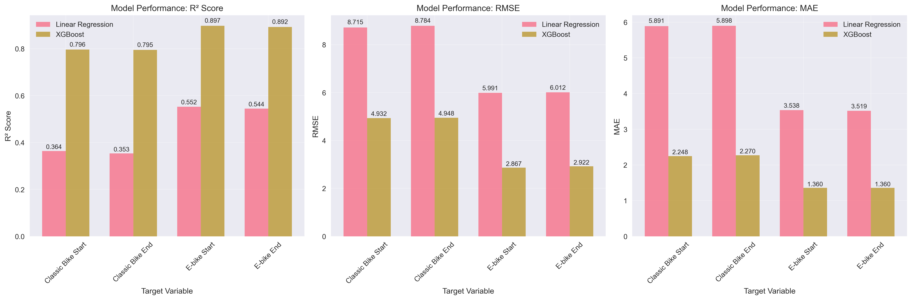

# Demand Prediction for Bike Share System Expansion

This project aims to predict the trip demand at new stations when bike share systems consider expanding. To plan successful bike share systems , many cities start from a small-scale pilot and gradually expand the system to cover more areas. Planning new stations based on existing ones over time requires prediction of the number of trips generated by these new stations across the whole system. This project will leverage historical trip data from existing stations and predict ridership at candidate sites.


### Divvy system has been expanding over the past few years


## Project Overview

This project develops predictive models for bike share station demand by integrating multiple data sources including:
- **Divvy bike share trip data** (2021-2025)
- **Census demographic data** (Cook County)
- **Points of Interest (POI) data** from OpenStreetMap
- **Transportation infrastructure** (CTA stations, bus stops, bike routes)
- **Spatial proximity metrics** (station density at various distances)

The models predict four key metrics:
- `cbike_start`: Average daily classic bike trip starts by month
- `cbike_end`: Average daily classic bike trip ends by month  
- `ebike_start`: Average daily electric bike trip starts by month
- `ebike_end`: Average daily electric bike trip ends per month

## Key Results

### Model Performance Summary

| Model Type | Target Variable | Test R² | Test RMSE | Test MAE |
|------------|----------------|---------|-----------|----------|
| **XGBoost** | cbike_start | **0.796** | 4.93 | 2.25 |
| **XGBoost** | cbike_end | **0.795** | 4.95 | 2.27 |
| **XGBoost** | ebike_start | **0.897** | 2.87 | 1.36 |
| **XGBoost** | ebike_end | **0.892** | 2.92 | 1.36 |
| Linear Regression | cbike_start | 0.364 | 8.72 | 5.89 |
| Linear Regression | cbike_end | 0.353 | 8.78 | 5.90 |
| Linear Regression | ebike_start | 0.552 | 5.99 | 3.54 |
| Linear Regression | ebike_end | 0.544 | 6.01 | 3.52 |

### Key Findings

1. **XGBoost significantly outperforms Linear Regression** across all target variables
2. **Electric bike demand is more predictable** than classic bike demand (R² > 0.89 vs ~0.80)
3. **Seasonal patterns are critical** - month features rank among top predictors
4. **Socioeconomic factors matter** - per capita income and demographic composition are highly influential
5. **Infrastructure proximity** - nearby stations and transportation access significantly impact demand

## Project Structure

```
parkchargebike/
├── code/                          # Analysis scripts
│   ├── process_divvy_data.py      # Process raw Divvy trip data
│   ├── calc_station_poi.py        # Calculate POI counts around stations
│   ├── calc_station_census.py     # Map stations to census tracts
│   ├── calc_station_infrastructure.py # Calculate infrastructure metrics
│   ├── model_linear_regression.py # Linear regression modeling
│   ├── model_xgboost.ipynb        # XGBoost modeling notebook
│   └── eda.ipynb                  # Exploratory data analysis
├── data/                          # Raw data files
│   ├── cook_county_census_tracts.geojson
│   ├── CTA_*_Stations_*.geojson
│   └── Bike_Routes_*.geojson
├── result/                        # Processed data and results
│   ├── *.csv                      # Processed datasets
│   ├── *.html                     # Interactive error heatmaps
│   └── *.joblib                   # Trained models
└── trip/                          # Monthly trip summaries
    └── *.csv                      # Station-level monthly data
```

## Data Sources

### Primary Data
- **Divvy Bike Share**: Monthly trip data (2021-2025) from Chicago's bike share system
- **Cook County Census**: Demographic and socioeconomic data at tract level
- **OpenStreetMap POIs**: Tourism, education, medical, shopping, and leisure locations

### Infrastructure Data
- **CTA Rail Stations**: Chicago Transit Authority rail stops
- **CTA Bus Stops**: Bus stop locations
- **Bike Routes**: Designated bike path network
- **Street Centerlines**: Road network data

### Spatial Features
- **Station Density**: Count of nearby stations at 250m, 500m, 750m, 1000m, 1250m, 1500m intervals
- **Buffer Analysis**: 500m buffers around each station for POI and infrastructure counts

## 🎯 Feature Engineering

### Temporal Features
- **Month indicators**: One-hot encoded seasonal patterns

### Spatial Features
- **Station density**: Nearby station counts at multiple distance bands
- **Infrastructure proximity**: Rail stops, bus stops, bike routes within buffers
- **POI density**: Points of interest counts by category

### Demographic Features
- **Population characteristics**: Age, gender, race/ethnicity distributions
- **Socioeconomic status**: Income, education, employment
- **Transportation behavior**: Commute modes, car ownership

### Derived Features
- **Log transformations**: Applied to skewed variables
- **Standardization**: Z-score normalization for model training

## 🤖 Model Development

### Data Split
- **Training**: January 2021 - July 2024 (43 months)
- **Test**: August 2024 - July 2025 (12 months)
- **Cross-validation**: 5-fold CV for robust evaluation

### Model Types
1. **Linear Regression**: Baseline model with VIF-based feature selection
2. **XGBoost**: Gradient boosting with hyperparameter optimization

### Evaluation Metrics
- **R²**: Coefficient of determination
- **RMSE**: Root mean square error
- **MAE**: Mean absolute error

## Visualizations

### Model Performance Comparison


### Feature Importance Analysis


## Key Insights

### Top Predictors by Importance
1. **Seasonal patterns** (month features)
2. **Per capita income** - higher income areas show greater bike share usage
3. **Station density** - proximity to other stations increases demand
4. **Demographics** - young adults (20-34) and walk-to-work populations
5. **Transportation infrastructure** - rail stops and bike routes

### Business Implications
- **Station placement**: Focus on high-income, young adult neighborhoods
- **Seasonal planning**: Adjust capacity and maintenance schedules
- **Network effects**: Dense station networks create positive feedback loops
- **Infrastructure investment**: Bike routes and transit connections drive usage

## Data Summary

- **Total Stations**: 1,854 unique stations
- **Time Period**: 55 months (Jan 2021 - Jul 2025)
- **Features**: 64 engineered features per station-month
- **Training Samples**: ~80,000 station-month observations
- **Test Samples**: ~20,000 station-month observations

## Available Results

### Model Results
- `best_models_summary.csv`: Linear regression model performance summary
- `xgboost_results.csv`: XGBoost model performance summary
- `feature_importance.csv`: Feature importance rankings for all models
- `linear_regression_results.txt`: Detailed linear regression results

### Trained Models
- `xgboost_model_*.joblib`: Trained XGBoost models for each target variable

### Error Analysis
- `instance_errors_*.csv`: Individual prediction errors for each station
- `error_heatmap_*.html`: Interactive spatial error visualizations
- `shap_global_summary_*.csv`: SHAP feature importance analysis
- `shap_worst_error_contrib_*.csv`: SHAP analysis for worst predictions

### Data Files
- `master_stations_*.csv`: Station-level processed datasets
- `training_dataset.csv` / `test_dataset.csv`: Final modeling datasets
- `monthly-active-stations.csv`: Station activity over time

## Technical Details

### Model Architecture
- **XGBoost Parameters**: 
  - Learning rate: 0.1
  - Max depth: 6
  - N estimators: 200
  - Subsample: 0.8-0.9
  - Colsample by tree: 0.8-0.9

### Performance Optimization
- **GPU acceleration** for XGBoost training
- **Cross-validation** for robust performance estimation
- **Feature selection** to reduce overfitting
- **Hyperparameter tuning** via grid search

## 🚀 Quick Start

### Viewing Results
1. **Interactive Error Maps**: Open any `error_heatmap_*.html` file in a web browser
2. **Model Performance**: Check `result/xgboost_results.csv` for detailed metrics
3. **Feature Importance**: Review `result/feature_importance.csv` for key predictors
4. **Exploratory Analysis**: Run `code/eda.ipynb` for interactive data exploration

### Using Trained Models
```python
import joblib
import pandas as pd

# Load a trained model
model = joblib.load('result/xgboost_model_cbike_start.joblib')

# Load preprocessed data
data = pd.read_csv('result/test_dataset_preprocessed.csv')

# Make predictions
predictions = model.predict(data[feature_columns])
```

### Reproducing Results
```bash
# Run the complete pipeline
python code/process_divvy_data.py
python code/calc_station_poi.py
python code/calc_station_census.py
python code/calc_station_infrastructure.py
python code/prepare_training_test_datasets.py
python code/model_linear_regression.py
# Run model_xgboost.ipynb for XGBoost models
```


---

*Last updated: January 2025*
